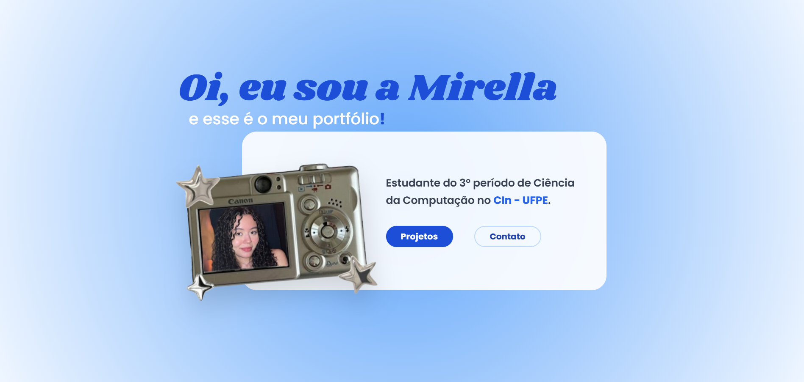

# 👩‍💻 Primeiro Portfólio Pessoal - Mirella Fontinelle



## 👋 Sobre o Projeto

### **Seja bem-vindo ao repositório do meu portfólio!** 
Este projeto foi desenvolvido para documentar e apresentar minha trajetória durante meu primeiro ano em **Ciência da Computação na UFPE**, além de aprender e treinar um pouco mais sobre desenvolvimento web.

Tentei incluir elementos para criar minha própria identidade visual de acordo com minhas preferências estéticas no design, que é uma área que tenho muito carinho!

🔗 **Acesse o projeto online:** [https://portfolio-mirella-2025.vercel.app/]

## 🚀 Tecnologias Utilizadas

O projeto foi construído com foco em performance e organização de código:

*  **React:** Biblioteca principal para construção da interface.
*  **TypeScript:** Para tipagem estática e segurança no código.
*  **Tailwind CSS:** Para estilização rápida, responsiva e efeitos visuais.
*  **Vite:** Build tool para desenvolvimento ágil.
* **Vercel:** Plataforma utilizada para CI/CD e hospedagem.

## ✨ Funcionalidades e Destaques

* **Design Responsivo:** Layout adaptável para dispositivos mobile e desktops.
* **Interactive Cards:** Cards de projetos com efeitos de rotação, escala e blur controlados via estado do React (`useState`).
* **Modais Dinâmicos:** Sistema de janelas que abrem sobre a interface para mostrar detalhes técnicos dos projetos sem recarregar a página.
* **Estética:** Uso de gradientes, sombras e elementos visuais (alfinetes, estrelas) que remetem ao meu estilo de design.
* **SVG Icons:** Implementação de ícones vetoriais diretamente no código para qualidade da criação.

## 📦 Como rodar localmente

Para clonar este repositório e testar em seu computador:

1.  **Clone o repositório:**
    ```bash
    git clone https://github.com/font-mirella/portfolio-2025.git
    ```

2.  **Entre na pasta:**
    ```bash
    cd portfolio
    ```

3.  **Instale as dependências:**
    ```bash
    npm install
    ```

4.  **Rode o servidor de desenvolvimento:**
    ```bash
    npm run dev
    ```

5.  O projeto estará rodando em `http://localhost:5173`.

## 📬 Contato

Sinta-se à vontade para entrar em contato ou dar feedbacks sobre o código!

* **LinkedIn:** [linkedin.com/in/mirella-fontinelle]
* **Email:** [laurmirella@gmail.com]

---
Obrigada pela atenção! 💙

Desenvolvido por Mirella Fontinelle.